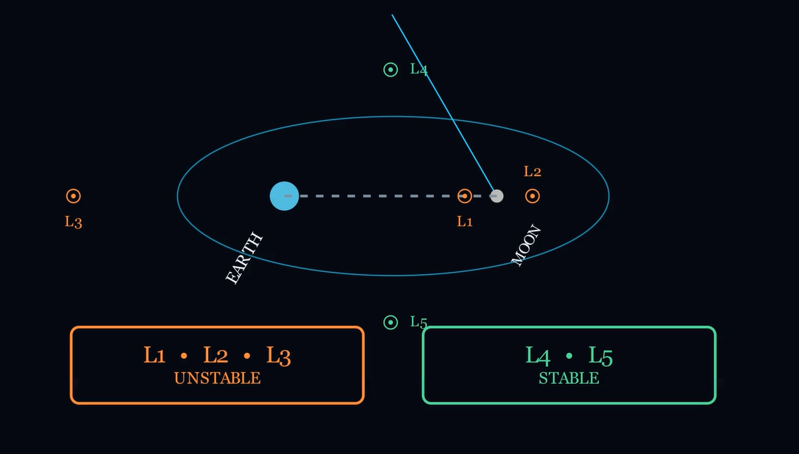

# Lagrange Point Explorer 🌌 (No)

**Lagrange Point Explorer** is a Python-based educational visualization built with **Manim, NumPy, and the Circular Restricted Three-Body Problem (CR3BP)**.

The animation explores the five Lagrange points of the **Earth–Moon system**, showing their geometry, stability characteristics, and how a small satellite perturbation behaves near unstable and stable equilibrium points.

---
## Preview



## 🎯 Problem Demonstrated

In a rotating two-body gravitational system, there are five special locations where the gravitational and rotational effects can balance for a massless object.

These are the **Lagrange points L1–L5**.

The animation demonstrates an important distinction:

- **L1, L2, L3 → Unstable equilibrium**
- **L4, L5 → Stable equilibrium for the Earth–Moon mass ratio**

Instead of treating these points as static coordinates, the project calculates the collinear points numerically and then uses the resulting physics to visualize satellite behavior.

---

## 🚀 Key Features

- 🌍 Visualizes the **Earth–Moon system** and barycenter.
- 📍 Calculates **L1, L2, and L3 numerically** using bisection root finding.
- 🔺 Constructs **L4 and L5 using exact equilateral-triangle geometry**.
- 🌀 Visualizes the rotating barycentric reference frame.
- 🛰️ Simulates a massless satellite using the **CR3BP equations of motion**.
- ⚠️ Demonstrates **satellite drift after perturbing L1**.
- 🟢 Demonstrates **libration around L4**.
- 🎨 Uses color-coded visualization to distinguish stable and unstable points.
- 🎬 Produces a complete educational Manim animation explaining the concepts progressively.

---

## 🧮 Physics & Technical Approach

The project uses the **Circular Restricted Three-Body Problem (CR3BP)**.

### Normalized Rotating Frame

The Earth–Moon system is represented in normalized barycentric coordinates:

- Separation = 1
- Total mass = 1
- Angular velocity = 1

The dimensionless mass parameter is calculated as:

```text
μ = m₂ / (m₁ + m₂)
